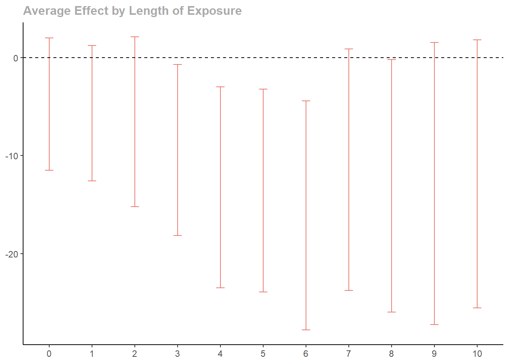

# sequential-SDiD

Sequential Synthetic Difference-in-Differences (sequential SDiD)
estimator for event studies with staggered treatment adoption.

This package estimates average treatment effect, particularly when the
parallel trends assumption fails.

## Installation

The package can be installed from github using devtools.

``` r
install.packages("devtools")
devtools::install_github("AntonZudin/sequential-SDiD")
```

## Usage

``` r
library(seq.sdid)
data(CHC)
set.seed(42)
```

The package uses 2 functions to prepare the dataset .

### 1. `to_wide`

- Converts panel from long to wide format.
- Creates Y, W and X dataframes with adoption date column being the
  first one.

### 2. `prepare_wide`

- If the level is `cohort`, aggregates on the data on the cohort level.
- If the level is `unit`, removes the adoption date column.

``` r
panel <- to_wide(CHC,
  unit = 1, time = 3, outcome = 2,
  treatment = 4, contr_covs = c(5), treat_covs = c(),
  population = 6
)

panel$X$popwt <- panel$X$popwt / 10000

panel_avg <- prepare_wide(panel, level = "cohort")
```

``` r
s2 <- estimate_s2(panel$Y[, -1], panel$W[, -1], panel$X$popwt)
est <- sequential_estimator(
  panel_avg,
  s2 = s2,
  type = "sdid")
est
```

    ## Synthetic DiD:
    ## -4.74 -5.68 -6.56 -9.44 -13.22 -13.56 -16.10 -11.43 -13.07 -12.85 -11.87 -13.72 -12.59 -10.72 -12.35 -15.61 -14.19 -12.45 -9.56 -12.38 -0.60 -2.39 -75.64 -64.37 
    ## 
    ## s2: 2728.60

``` r
se <- vcov(est, panel)
cat(sprintf("%1.2f", se), "\n")
```

    ## 3.44 3.52 4.42 4.45 5.23 5.28 5.96 6.28 6.57 7.34 6.97 9.54 9.97 10.26 10.97 11.74 11.85 12.79 14.03 15.22 14.86 16.47 48.96 54.12

``` r
plot(est, se, 11, error_bar_width = 0.2)
```



#### References

Dmitry Arkhangelsky, Aleksei Samkov. <b>Sequential Synthetic Difference
in Differences</b>, 2025.
\[<a href="https://arxiv.org/abs/2404.00164">arxiv</a>\]
