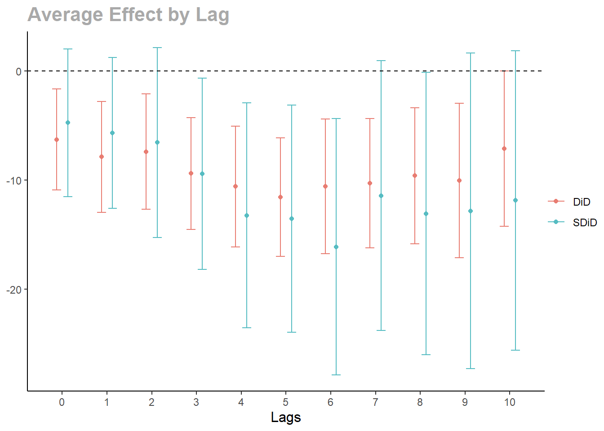

# sequential-SDiD

Sequential Synthetic Difference-in-Differences (sequential SDiD)
estimator for event studies with staggered treatment adoption.

This package estimates average treatment effect, particularly when the
parallel trends assumption fails.

## Installation

The package can be installed from github using devtools.

``` r
install.packages("devtools")
devtools::install_github("AntonZudin/sequential-SDiD")
```

## Usage

``` r
library(seq.sdid)
data(CHC)
set.seed(42)
```

The package uses 2 functions to prepare the dataset .

### 1. `to_wide`

- Converts panel from long to wide format.
- Creates Y, W and X dataframes with adoption date column being the
  first one.

### 2. `prepare_wide`

- If the level is `cohort`, aggregates on the data on the cohort level.
- If the level is `unit`, removes the adoption date column.

``` r
panel <- to_wide(CHC,
  unit = 1, time = 3, outcome = 2,
  treatment = 4, contr_covs = c(5), treat_covs = c(),
  weights = 6
)

panel$X$popwt <- panel$X$popwt / 10000

panel_avg <- prepare_wide(panel, level = "cohort")
```

Estimate the noise variance on the untreated part of the panel.

``` r
s2 <- estimate_s2(panel$Y[, -1], panel$W[, -1], panel$X$popwt)
```

``` r
est <- sequential_estimator(
  panel_avg,
  s2 = s2,
  type = "both",
  aggregate_effect = aggregate_inv_did_var)
print(est, n_lags = 11)
```

    ## Synthetic DiD:
    ## -4.76 -5.68 -6.57 -9.45 -13.25 -13.57 -16.13 -11.44 -13.09 -12.84 -11.88 
    ## 
    ## DiD:
    ## -6.30 -7.88 -7.41 -9.41 -10.61 -11.58 -10.59 -10.30 -9.62 -10.06 -7.15 
    ## 
    ## s2: 2728.60

Estimate standard error with Bayesian bootstrap.

``` r
se <- vcov(est, panel, B = 1000)
cat("St. error of SDiD estimator:", "\n")
```

    ## St. error of SDiD estimator:

``` r
cat(sprintf("%1.2f", se$se_sdid[1:11]), "\n\n")
```

    ## 3.46 3.53 4.44 4.47 5.26 5.31 6.00 6.32 6.60 7.38 7.00

``` r
cat("St. error of DiD estimator:", "\n")
```

    ## St. error of DiD estimator:

``` r
cat(sprintf("%1.2f", se$se_did[1:11]), "\n")
```

    ## 2.37 2.60 2.71 2.62 2.83 2.77 3.15 3.02 3.18 3.61 3.63

``` r
plot(
  est, se, 11,
  error_bar_width = 0.4, xlab = "Lags",
  legend_position = "right"
)
```



#### References

Dmitry Arkhangelsky, Aleksei Samkov. <b>Sequential Synthetic Difference
in Differences</b>, 2025.
\[<a href="https://arxiv.org/abs/2404.00164">arxiv</a>\]
