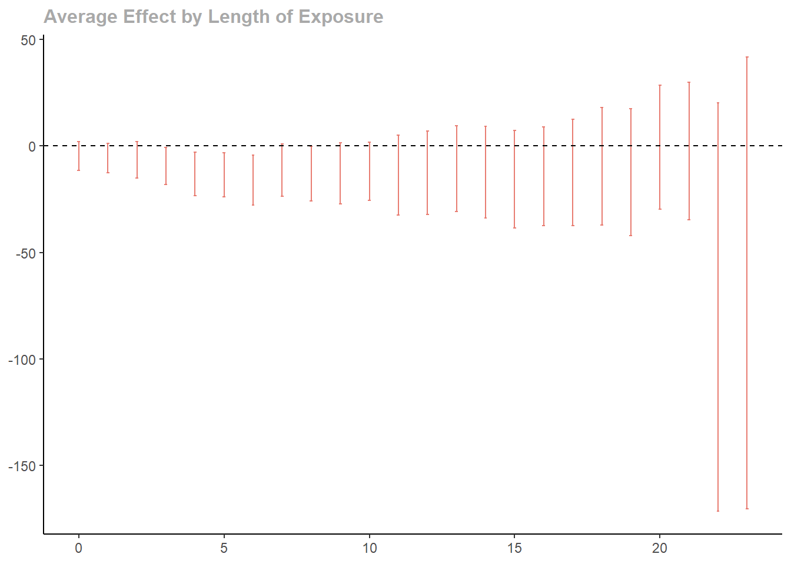

# sequential-SDiD

Sequential Synthetic Difference-in-Differences (sequential SDiD)
estimator for event studies with staggered treatment adoption.

This package estimates average treatment effect, particularly when the
parallel trends assumption fails.

## Installation

The package can be installed from github using devtools.

``` r
# install.packages("devtools")
devtools::install_github("AntonZudin/sequential-SDiD")
```

## Usage

``` r
library(seq.sdid)
data(CHC)
```

The package uses 2 functions to prepare the dataset .

### 1. `to_wide`

- Converts panel from long to wide format.
- Creates Y, W and X dataframes with adoption date column being the
  first one.

### 2. `prepare_wide`

- If the level is `cohort`, aggregates on the data on the cohort level.
- If the level is `unit`, removes the adoption date column.

``` r
panel <- to_wide(CHC,
  unit = 1, time = 3, outcome = 2,
  treatment = 4, contr_covs = c(5), treat_covs = c(),
  population = 6
)

panel$X$popwt <- panel$X$popwt / 10000

panel_avg <- prepare_wide(panel, level = "cohort")
```

``` r
set.seed(42)
s2 <- estimate_s2(panel$Y[, -1], panel$W[, -1], panel$X$popwt)
est <- sequential_estimator(
  panel_avg,
  s2 = s2,
  type = "sdid")
est
```

    ## Synthetic DiD:
    ##  [1]  -4.7366330  -5.6752393  -6.5541976  -9.4308235 -13.2132950 -13.5642393
    ##  [7] -16.0897075 -11.4382592 -13.0642840 -12.8587324 -11.8731736 -13.7330057
    ## [13] -12.5923667 -10.7225772 -12.3626838 -15.6106691 -14.1941706 -12.4548575
    ## [19]  -9.5632432 -12.3932205  -0.6046544  -2.3971936 -75.6481254 -64.3606602
    ## 
    ## s2: 2754.343

``` r
se <- vcov(est, panel)
se
```

    ##  [1]  3.439639  3.513936  4.413344  4.442600  5.221117  5.271454  5.954114
    ##  [8]  6.274601  6.561208  7.333960  6.966803  9.532407  9.962142 10.251787
    ## [15] 10.959019 11.725110 11.843486 12.775326 14.022057 15.215228 14.856568
    ## [22] 16.465161 48.925193 54.078878

``` r
plot(est, se)
```


